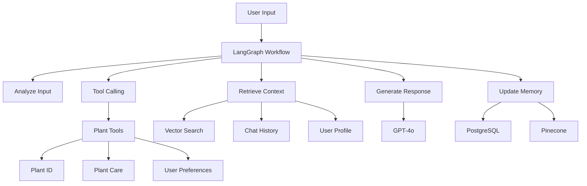

# LangChain & LangGraph Enhanced Chat System

## 🚀 Tổng quan

Hệ thống chat sử dụng **LangChain** và **LangGraph** để cung cấp trải nghiệm hội thoại AI tiên tiến với:

- **Workflow Management**: LangGraph để quản lý luồng hội thoại
- **Tool Calling**: Tích hợp các tools cho plant identification và care advice
- **Memory Management**: PostgreSQL + LangChain memory cho context dài hạn
- **Vector Search**: Pinecone với LangChain vector stores
- **Streaming Responses**: Real-time response streaming
- **Advanced Agents**: OpenAI functions agent với custom tools

## 🏗️ Kiến trúc



## 🛠️ Components

### LangGraph Workflow

**Nodes**:
- `analyze_input`: Phân tích intent và entities từ user input
- `retrieve_context`: Lấy context từ vector store và chat history
- `generate_response`: Tạo response cá nhân hóa với LLM
- `update_memory`: Cập nhật memory và user profile
- `tools`: Node để thực thi các tools

**Flow Logic**:
```python
START → analyze_input → [tools?] → retrieve_context → generate_response → update_memory → END
```

### Custom Tools

1. **PlantIdentificationTool**
   - Nhận diện cây từ hình ảnh
   - Tích hợp với DiagnosisService
   - Trả về plant species và confidence score

2. **get_plant_care_info**
   - Lấy thông tin chăm sóc comprehensive
   - Dựa trên plant species và issue cụ thể
   - Knowledge base integration

3. **save_user_preference**
   - Lưu preferences cho personalization
   - Update user profile trong database
   - Cải thiện future interactions

### Memory Management

- **ConversationBufferWindowMemory**: Quản lý conversation context
- **PostgresChatMessageHistory**: Persistent chat history
- **User Profile**: Lưu trữ preferences và learning patterns

## 🚀 API Endpoints

### Chat Endpoints (v3)

**Base URL**: `/api/v3/chat`

#### POST `/` - Main Chat
```json
{
  "message": "What's wrong with my monstera?",
  "session_id": "optional-session-id",
  "image_data": "base64-encoded-image",
  "stream": true
}
```

**Response** (streaming):
```
data: Here's what I can see...
data: Your monstera appears to have...
data: [DONE]
```

#### POST `/sessions` - Create Session
```json
{
  "title": "Monstera Care Discussion"
}
```

#### GET `/sessions` - List Sessions
```json
[
  {
    "session_id": "uuid",
    "title": "Monstera Care",
    "created_at": "2025-08-14T10:00:00Z",
    "message_count": 15,
    "is_active": true
  }
]
```

#### GET `/sessions/{session_id}/messages` - Get Messages
```json
{
  "session_id": "uuid",
  "messages": [
    {
      "role": "user",
      "content": "Help with my plant",
      "created_at": "2025-08-14T10:00:00Z"
    }
  ]
}
```

#### GET `/tools` - Available Tools
```json
[
  {
    "name": "plant_identification",
    "description": "Identify plants from images",
    "parameters": ["image_data"]
  }
]
```

#### GET `/workflow/status` - Workflow Info
```json
{
  "workflow_enabled": true,
  "nodes": ["analyze_input", "retrieve_context", "generate_response"],
  "features": ["Tool calling", "Memory management", "Personalization"]
}
```

## 🎯 Key Features

### 1. Advanced Conversation Flows
- **State Management**: ConversationState với full context
- **Conditional Logic**: Intelligent routing based on input analysis
- **Error Handling**: Robust error recovery và fallbacks

### 2. Tool Integration
- **Dynamic Tool Selection**: Based on intent analysis
- **Parallel Execution**: Multiple tools có thể chạy đồng thời
- **Result Integration**: Tool outputs được integrate vào response

### 3. Personalization Engine
- **User Profiling**: Experience level, communication style, plant collection
- **Adaptive Responses**: Tailored based on user history
- **Learning**: System learns từ interactions để improve

### 4. Memory & Context
- **Short-term**: Conversation buffer cho current session
- **Long-term**: PostgreSQL storage cho persistent memory
- **Vector Memory**: Pinecone cho semantic context retrieval

## 🔧 Configuration

### Environment Variables
```env
# LangChain Settings
LANGCHAIN_TRACING_V2=true
LANGCHAIN_API_KEY=your-langsmith-key

# Model Configuration
OPENAI_MODEL=gpt-4o
EMBEDDING_MODEL=text-embedding-3-small

# Workflow Settings
MAX_ITERATIONS=10
TOOL_TIMEOUT=30
STREAMING_ENABLED=true
```

### Customization

**Custom Prompt Template**:
```python
def _create_system_prompt(self, user_profile, plant_context):
    return f"""You are PlantBot specialized in {user_profile['expertise']}.

    Current context: {plant_context}
    User preferences: {user_profile['style']}
    """
```

**Custom Tools**:
```python
@tool
async def my_custom_tool(parameter: str) -> str:
    """Custom tool description"""
    # Implementation
    return result
```

## 📊 Performance & Monitoring

### Metrics
- **Response Time**: Average processing time per request
- **Tool Usage**: Frequency of each tool được sử dụng
- **User Satisfaction**: Based on feedback scores
- **Conversation Length**: Average messages per session

### Monitoring
- **LangSmith**: Tracing và debugging workflows
- **Custom Logging**: Detailed logging cho mỗi workflow step
- **Error Tracking**: Comprehensive error monitoring

## 🧪 Testing

```bash
# Test LangChain chat
curl -X POST http://localhost:5000/api/v3/chat/ \
  -H "Content-Type: application/json" \
  -H "Authorization: Bearer your-token" \
  -d '{
    "message": "Help identify this plant",
    "stream": true
  }'

# Test tools endpoint
curl http://localhost:5000/api/v3/chat/tools

# Test workflow status
curl http://localhost:5000/api/v3/chat/workflow/status
```

## 🚀 Deployment

1. **Install Dependencies**: `uv sync`
2. **Configure Environment**: Set LangChain và OpenAI keys
3. **Run Migrations**: Database setup cho chat tables
4. **Start Server**: `uv run fastapi dev src/main.py`
5. **Test API**: Access `/docs` để test endpoints

## 🎉 Benefits

### So với Enhanced Chat (v2):
- **More Structured**: LangGraph workflows vs linear processing
- **Better Tool Integration**: Native LangChain tool support
- **Advanced Memory**: Multiple memory types với vector search
- **Monitoring**: Built-in tracing với LangSmith
- **Extensibility**: Easier để add new tools và workflows

### Use Cases:
- **Plant Diagnosis**: Multi-step analysis với tool calling
- **Care Planning**: Sequential workflows cho comprehensive advice
- **Learning Conversations**: Adaptive responses based on user progress
- **Expert Consultations**: Advanced reasoning với multiple information sources

Hệ thống LangChain mang lại trải nghiệm chat AI tiên tiến nhất cho Plant Assistant! 🌱🤖
